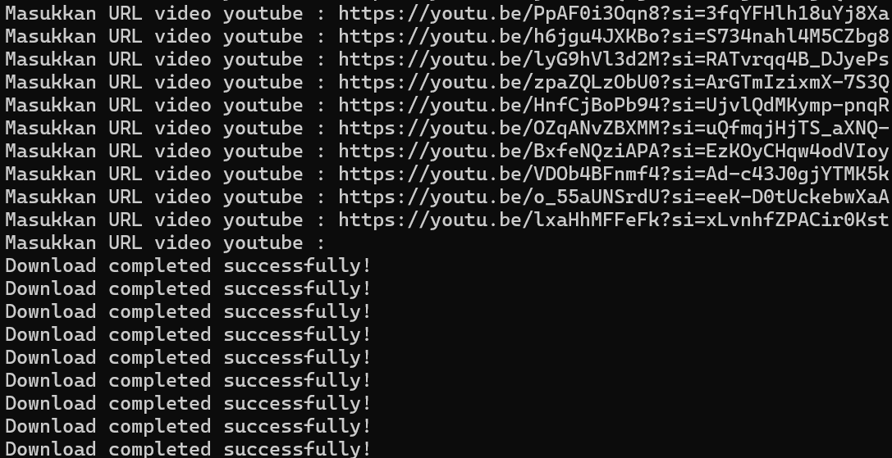

# YT MP4

Ini sebuah aplikasi python sederhana dimana disini kalian bisa download video youtube ke local tanpa iklan dan cepat itu akan mempermudah kita dalam download video dari youtube yang di inginkan.

## Instalasi
Peringatan : Pastikan terlebih dahulu Python nya sudah tersedia dengan cara : 
```bash
python -V 
```

1. Download file ini dengan cara klik "Code" terus pilih "Download ZIP"
2. Extract ZIP dalam folder
3. Klik kanan "Open in Terminal"
4. Jalankan code berikut ini 
	```Bash
	python index.py
	```


## Penggunaan

Setelah Terbuka nanti tampilannya seperti dibawah ini


### Langkah-langkah menggunakan
1. Cari video di Youtube
2. Klik "Bagikan" => "Salin Link"
3. Paste di terminal aplikasinya seperti gambar di atas itu bang
4. Kalau sudah tekan enter dan anda bisa juga menambahkan link video lagi 
5. Jika link videonya sudah semua maka tempat paste url tadi itu di kosongin aja lalu enter atau bisa Enter 2 kali maka proses download akan berjalan


## Kontribusi

Jika Anda ingin berkontribusi, silakan follow github saya dan youtube saya ada di https://www.youtube.com/@indopin-senapernata.

## Lisensi

[Indonesia my love programmer ](github.com/sena-ux) © Sena Pro UX
